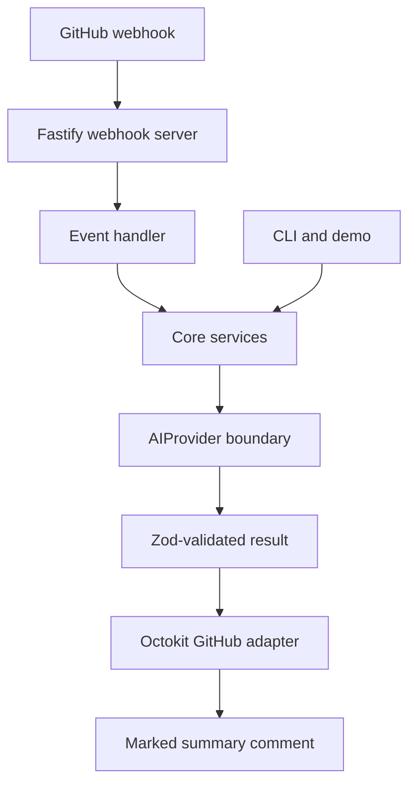
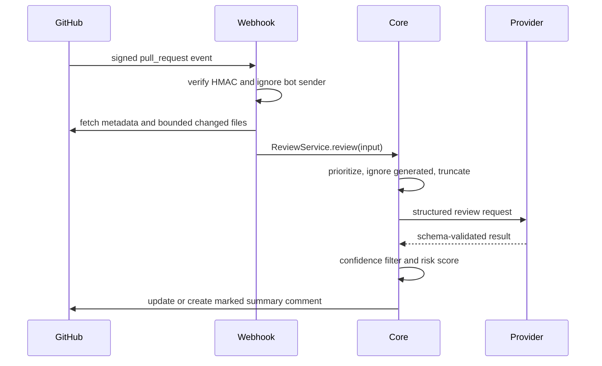

# Architecture

OpenMaintainer is a small TypeScript monorepo. Domain workflows are dependency-injected and do not know how HTTP or GitHub works.



## Trust boundaries

GitHub titles, descriptions, diffs, issue comments, commits, and documentation are untrusted data. They are framed in prompts but never promoted to instructions. The server never executes repository code, evaluates generated code, or passes repository strings to a shell. Provider credentials are held by the adapter process and are never included in prompts.

## Package boundaries

- `shared`: schemas, domain types, errors, bounded text, signatures, and sanitization.
- `config`: strict Zod configuration schema and YAML loading.
- `prompts`: versioned prompt source with explicit injection defenses.
- `ai`: `AIProvider`, OpenAI-compatible HTTP adapter, schemas, and mock provider.
- `core`: review, triage, duplicate ranking, release notes, command parsing, permissions, risk scoring, and output rendering.
- `github`: Octokit adapter and comment upsert behavior.
- `github-app`: Fastify transport and event orchestration.
- `cli`: local workflows and demo.

## Pull request sequence



## Issue and duplicate sequence

```mermaid
sequenceDiagram
  participant G as GitHub
  participant W as Webhook
  participant C as Core
  participant P as Provider
  G->>W: issues opened
  W->>G: fetch issue and search bounded candidates
  W->>C: triage and local similarity
  C->>P: issue plus strongest candidates
  P-->>C: confidence-ranked comparisons
  C->>G: optional marked comment; no automatic close
```

Core's public barrel preserves the existing exports. Review selection/risk/service/rendering, issue triage/duplicates/rendering, release generation and commands are cohesive modules. The app entrypoint composes environment loading and server creation; `server.ts` owns raw-byte verification, replay/capacity control and safe errors, `events.ts` owns routing and small domain handlers, and `adapters.ts` initializes installation-scoped Octokit. No DI framework or database was introduced.

The app is synchronous: a process-local 10-minute/1,000-ID cache coalesces successful deliveries, a 20-request cap bounds pending work, and per-target promises serialize comment upserts. Failed deliveries are not cached. This state is neither durable nor shared across replicas. GitHub may time out before provider work completes; operators need manual or queued redelivery until a durable worker architecture exists.
